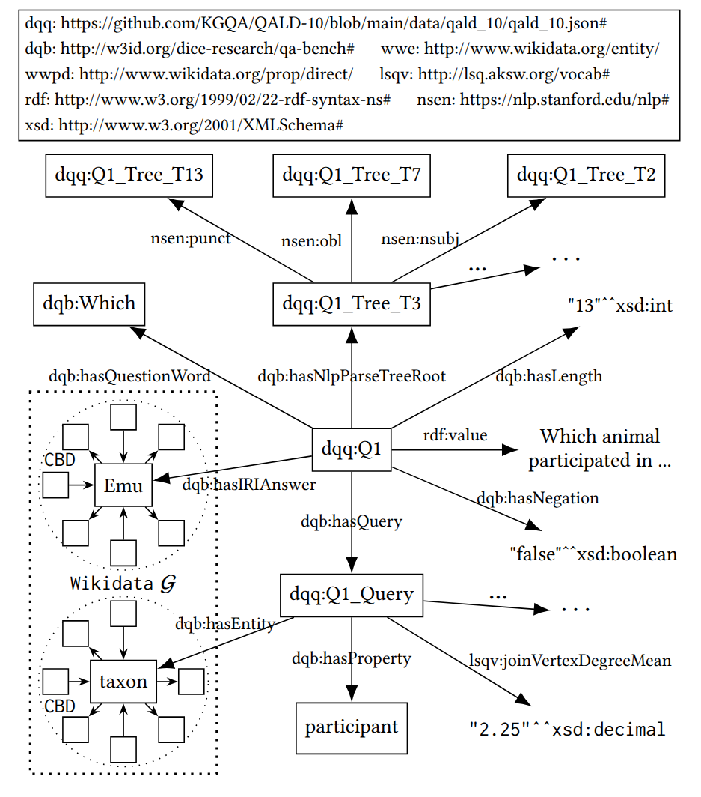

# Explainable Benchmarking through the Lense of Concept Learning
This repository contains 
* The source code of our concept learning approach PruneCEL
* Links and descriptions to rerun Experiments I and II
* The survey and its results of Experiment III

## Table of Contents
1. [Repository Structure](README.md#1-repository-structure)
2. [Running Experiments](README.md#2-running-experiments)
3. [Rerunning Experiment I](README.md#3-rerunning-experiment-i)
4. [Rerunning Experiment II](README.md#4-rerunning-experiment-ii)
5. [Details Experiment III](README.md#5-details-experiment-iii)
6. [FAQ](README.md#6-faq)

## 1. Repository Structure
The following directories and files can be found within this project:
```
+-Doc/Pic:      Pictures used in this README
+-Script_F_C_M: The scripts that we used to run PruneCEL in Experiment I
+-Script_QALD:  The scripts that we used to run PruneCEL in Experiment II
+-T_F_Json:     The learning problems of Experiment I and II
+-src:          The Java source code of PruneCEL
+-pom.xml:      File necessary to compile PruneCEL with Maven
```

TODO add survey details!

## 2. Running Experiments

### Experiment Setup

PruneCEL uses SPARQL queries to retrieve data from the underlying knowledge base. 
For our experiments, we used the triple store [Tentris](https://github.com/dice-group/Tentris). However, the experiments can be run with any other triple store (e.g., [Fuseki](https://jena.apache.org/documentation/fuseki2/)).
However, using a different triple store can lead to different results since PruneCEL moves a large amount of the work to the triple store, serving as oracle.

For our experiments, we relied on the implementations of the approaches CELOE, Drill, EvoLearner and NCES from the [Ontolearn](https://github.com/dice-group/ontolearn) project. We refer to this project with respect to the execution of these approaches. During our experiments, CELOE and DRILL were set up in a similar way as PruneCEL, i.e., we provided the address of the SPARQL endpoint and both approaches used SPARQL queries to retrieve the necessary data. However, the implementations of EvoLearner and NCES do not seem to support this feature at the moment and both have to load the data into memory before they start. Note that we did not take this loading time into consideration when measuring the runtime of these approaches.

### Compiling PruneCEL

PruneCEL is a Maven project and after downloading this repository, PruneCEL can be compiled using the following command:
```sh
mvn clean package
```
The result of the compilation and packaging process is available as `target/prune-cel-0.0.1-SNAPSHOT.jar`. In the following, we will name this jar file just `prune-cel.jar`, so you may want to move it using 
```sh
mv target/prune-cel-0.0.1-SNAPSHOT.jar prune-cel.jar
```

## 3. Rerunning Experiment I

Thankfully, the [Ontolearn project](https://github.com/dice-group/ontolearn) provides examples how to execute the related work approaches (CELOE, Drill, EvoLearner and NCES) on the benchmarking datasets.

For running 

## 4. Rerunning Experiment II

## 5. Details Experiment III


# Details of knowledge graph generation

## Reference knowledge graph details:


We build the knowledge graph QALD9+WD, QALD9+DB, and QALD10. 

The Wikidata reference knowledge graph(WKRF) we utilize for both QALD9+WD and QALD10 are available online: 
- **WKRF** &rarr; (https://zenodo.org/records/7496690). 
  
The DBpedia reference knowledge graph(DBRF) we utilize to build QALD9+DB can be found here: 
- **DBRF** &rarr; (https://downloads.dbpedia.org/2016-10/core-i18n/en/).


## Preprocessing details:
We apply preprocessing on both **WKRF** and **DBRF**. 

For **WKRF**, 
- All occurrences of the property `http://www.wikidata.org/prop/direct/P31` are replaced with `http://www.w3.org/1999/02/22-rdf\textbackslash-syntax-ns\#type`. 

For **DBRF**, 
- $43,618$ triples with IRIs that do not conform to global standards are removed, along with those having properties with the dbp prefix `http://dbpedia.org/property/`. Additionally, for entities belonging to a specific class, the entity type corresponding to all superclasses of that class is also added.

## Knowledge graph question details:

We build the knowledge graph for each dataset. 

  For **QALD10**, the knowledge graph comprises $394$ questions and the associated features. 

  For **QALD9+WK**, the dataset contains $136$ questions, however, only $116$ questions can be answered using the SPARQL queries provided by the gold standard answers, and only the answerable questions are used. 

  For **QALD9+DB**, the dataset contains $150$ questions, only $133$ are utilized for the same reason as above.


## Knowledge graph structure details:


See figure 1, We utilize `Question 1` from the **QALD10** to demonstrate the methodology:

  In **QALD10**, each question is represented by an IRI in the form `dqq:QX`, where `X` denotes the question's serial number.

  Each question has different answer types, represented by properties: `dqb:hasIRIAnswer`, `dqb:hasLiteralAnswer`, and `dqb:hasBooleanAnswer`.

  For questions that have IRI answers, the CBD of the corresponding IRI is extracted from **WKRF**.

  We employ the Stanford NLP toolkit to process each question in English. Key linguistic features are extracted, including the length of the question, the presence of negation, the question word, and the parse tree. Each word in the question is represented using its positional information, for example: `dqq:Q1\_Tree\_T2` denotes the second word in the question, which in this case is `animal`.

  For each question's SPARQL query, we also extract relevant features, including the entities and properties contain within the query itself. The CBD of the entities identified in the SPARQL query is also integrated by using **WKRF**.

## 6. FAQ

### Question about PruneCEL

1, Where can I get the knowledge graph?

    For the QALD system, you can get the graph on : URI

    For the Family, Mutagenesis and Carcinogenesis, you can get them on: URI

  
2, How can I run PruneCEL on QALD datasets(QALD10, QALD9+DB, QALD9+WK)?

    Load the knowledge graph using sparql endpoints,

    Run script in script_QALD directory, be care to change the URL(eg. 0.0.0.0:9080), sparql endpoint dir, and PrunCEL Dir to your OWN! 
    
3, Where can I find the learning problems?

    `/T_F_JSON`

### Question about Drill, CELOE

1, Where can I get the embedding and pretrained model for drill?

    Embedding model: 
    Pretrained model: 

2, Does CELOE need embedding?
    

    NO!
